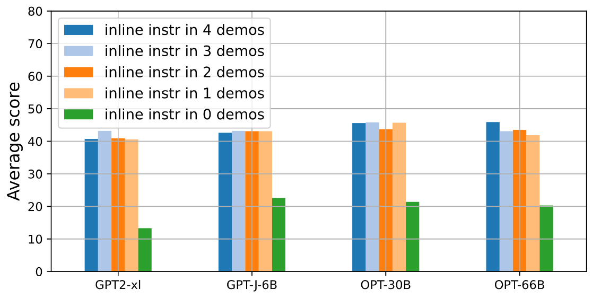

# Deconstructing In-Context Learning: Understanding Prompts via Corruption

This is the official code for **Deconstructing In-Context Learning: Understanding Prompts via Corruption**. Arxiv link [TBD]

Accepted to LREC-COLING 2024 main conference.


Repeated inline instruction boost model performance.


# **Keypoints**
1. Including repeated text in the prompt boosts model performance.
2. Addition of both task and in-line instructions improves model performance, even when these instructions are random words.
3. Larger models exhibit higher sensitivity to prompt semantics and pay more attention to the semantically relevant prompt components.

# Requirements
```
pip install -r requiremensts.txt
```

# A. Create Prompts

We take original task files from Super-NaturalInstructions and create the baseline files for each tasks. We also add in-line instructions which are not a part of SupernaturalInstructions. We used PromptSource to do changes to the instructions and labelspace to make the prompt easy and understandable.

- **Get original task files** -  We copied the task files manually from Super-NaturalInstructions dataset files to `src/data_generator/original_tasks`.
  
- **Reorder samples** - We need to reorder the samples in the original tasks files such that the top 100 samples are balanced and can be used to evaluation. We do that by using this command. 
        
        python src/data_generator/reorder_instances_for_testing.py

The reordered datafiles are saved to `src/data_generator/reordered_original_tasks`.
        
- **Create baseline files** - Baseline files are the files with baseline corruptions. The baseline files are created for each task and the files have suffix `_baseline` and can be found at `src/data_generator/processed-tasks`. 
  
  Note: `_baseline` files includes all components. Instruction, inline instruction in each demostrations and demostration inputs and labels.

  To create baseline files, run

        python src/data_generator/create_baseline_data.py

- **Add Semantic corruptions** - run the following command to add semantic corruptions to the baseline file. The corruption name is added as suffix to the task files. The corrupted files are stored in `src/data_generator/processed_tasks`.

        python src/data_generator/create_corrupted_data.py


# B. Datasets, models and metrics

We evaluate 10 models on 10 datasets. Out of 10 tasks, 8 are classification tasks and 2 are generation tasks.

- Classification Datasets are 
1) task1344_glue_entailment_classification
2) task843_financial_phrasebank_classification_baseline
3) task1645_medical_question_pair_dataset_text_classification
4) task116_com2sense_commonsense_reasoning
5) task512_twitter_emotion_classification
6) task379_agnews_topic_classification
7)  task828_copa_commonsense_cause_effect
8)  task1346_glue_cola_grammatical_correctness_classification

- generation datasets are
1) task1564_triviaqa_answer_generation 
2) task835_mathdataset_answer_generation 

- Models are GPT2-xl, GPT-J-6B, Pythia-12B, OPT-30B, OPT-30B-IML-MAX2, OPT-66B, Vicuna-33B, Llama-7B, Llama-2-70B and Llama-2-70B-
chat.

- Evaluation metrics - Exact match for classification and Rouge-L for generation tasks.


# C. Evaluation

- The datasets for evaluation are listed in `src/evaluation/test_tasks.txt`.
  
- TFirst we will get the prediction from the model for the specific list of corruptions, run the following to generation model prediction.
        
        python evaluation/evaluate_model.py /
        --modelname [MODELNAME] /
        --corruptions_name_list [LIST OF CORRUPTION NAMES] /
        --task_set_no [SET NUMBER] / 
        --max_target_len [MAXIMUM TARGET LENGTH] /
        --batch_size [EVALUATION BATCH SIZE]

        e.g. python evaluation/evaluate_model.py /
        --modelname facebook/opt-125m /
        --corruptions_name_list [empty,only_instruction] /
        --task_set_no set1 /
        --max_target_len 10 /
        --batch_size 16

This will save the prediction in the `output_dir/`

- Run the following script to compute metrics for the model predictions
        
        python evaluation/compute_metrics.py --predictions [PREDICTION JSONL FILE PATH] predicted_examples_[CORRUPTION NAME].jsonl --track default --compute_per_category_metrics --compute_per_task_metrics'

        e.g. 

        python evaluation/compute_metrics.py --predictions output/1.56B_gpt2-xl/set100/predicted_examples_only_instruction.jsonl --track default --compute_per_category_metrics --compute_per_task_metrics

- Jacknife variance estimation
  
  Once we have the metric, we use jacknife varaicne estimation method to compute mean and variance of the metric. Select an input file and run the notebook `src/evaluation/jacknife_variance_estimation.ipynb `.


# D. Attention plots

Firstly we pick 10 samples from each dataset where the model predicted correctly. For each of these sample, we compute component length and average attention norm on this components and save the complete jsonl file in `plot/collect_results/[modelname]_results`. Run the following command to get the complete jsol file for a corruption.


        python get_plots.py --file_path [PREDICTION JSONL FILEPATH] --corruption_name [CORRUPTION NAME]
        e.g.
        python get_plots.py --file_path ../predictions/6.05B_gpt-j-6B/all_corruptions/predicted_examples_all_instr_n_demo.jsonl --corruption_name all_instr_n_demo

Next we use `plots/get_plot_pdf.ipynb` notebook to plot attention plots which are presented inthe paper.

# Corruption names code supports

- 'empty',
- 'only_demostration',
- 'only_instruction',
- 'only_inline',
- 'both_instructions',
- 'instr_n_demo',
- 'inline_n_demo',
- 'all_instr_n_demo',
- 'instr_randomwords',
- 'labels_randomwords',
- 'input_empty', 
- 'label_empty', 
- 'input_ood',
- 'input_randomwords'
- 'inline_instr_in_0_demo',
- 'inline_instr_in_1_demo',
- 'inline_instr_in_2_demo',
- 'inline_instr_in_3_demo',
- 'randomwords_inline_instr_in_0_demo',
- 'randomwords_inline_instr_in_1_demo',
- 'randomwords_inline_instr_in_2_demo',
- 'randomwords_inline_instr_in_3_demo',

